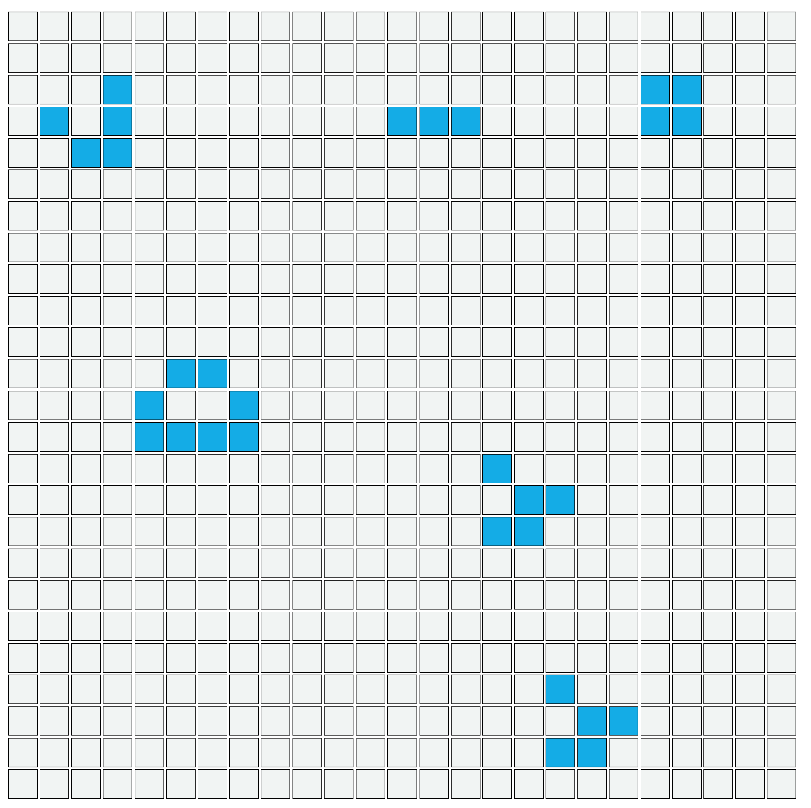

# Conway's Game of Life
Martijn van Veen

## Conway's game of life OOP

The Game of Life, also known simply as Life, is a cellular automaton devised by the British mathematician John Horton Conway in 1970.
It is a zero-player game, meaning that its evolution is determined by its initial state, requiring no further input. 
One interacts with the Game of Life by creating an initial configuration and observing how it evolves. 
It is Turing complete and can simulate a universal constructor or any other Turing machine.

## Rules
Any live cell with two or three live neighbours survives.
Any dead cell with three live neighbours becomes a live cell.
All other live cells die in the next generation. Similarly, all other dead cells stay dead.

## How to simulate
- On default a glider pattern will be simulated.
- Click right of the grid to pause the simulation. 
- Click nodes you want to 'revive'.
- Click right of the grid to start simulation.

## Extra info
- Check https://en.wikipedia.org/wiki/Conway%27s_Game_of_Life to look for 'special' patterns.
- Common pattern types include: still lifes, which do not change from one generation to the next; oscillators, which return to their initial state after a finite number of generations; and spaceships, which translate themselves across the grid.
- Change the 'size' variable in game_of_life.js to adjust the number of nodes in the simulation.

 
